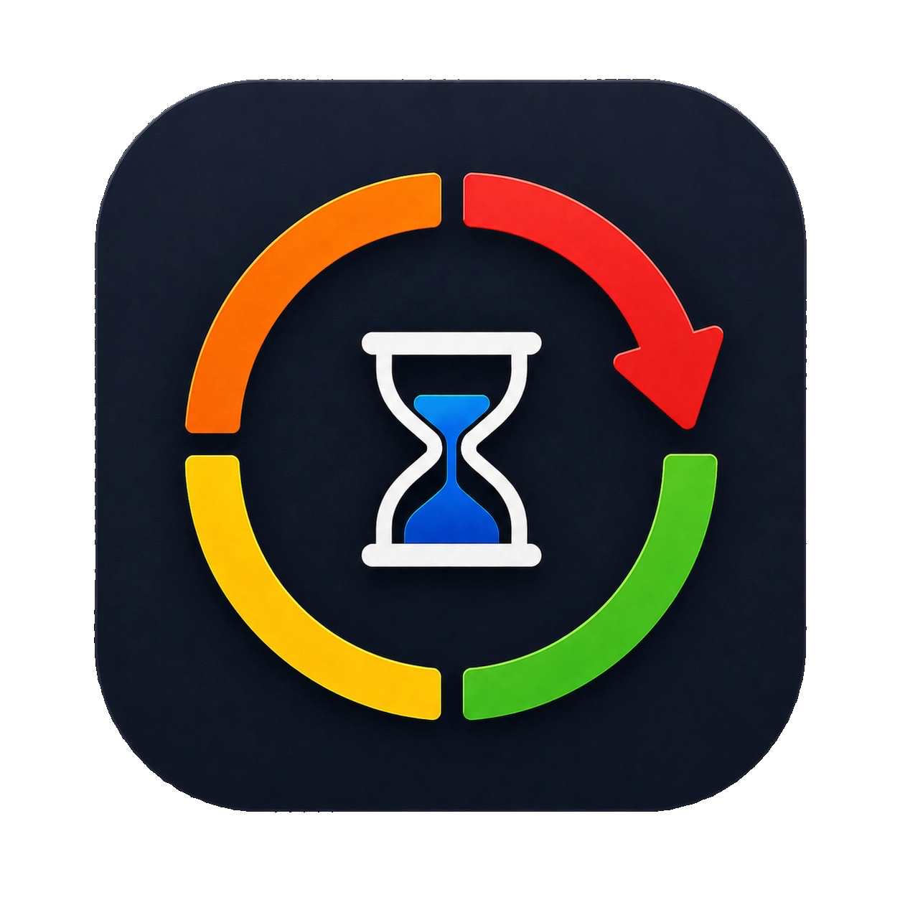

# Maintenance Tracker

  

Default HACS inclusion is still pending. For now, install it as a custom repository.

Maintenance Tracker is a lightweight productivity integration for Home Assistant.

It is a modern revival of an older project I built about 6 years ago:
[HowManyDaysSince](https://github.com/thanhn062/HowManyDaysSince)

The core idea is simple: keep track of recurring maintenance tasks that need attention every now and then, without turning them into a whole project management system. Things like changing bed sheets and pillowcases, cleaning up your PC, checking your car's fluids, replacing a water filter, and countless other small but important jobs all fit naturally here.

For the past 6 years, I have been using a Scriptable-based version of this idea as an iPhone home screen widget through my old project, [HowManyDaysSince](https://github.com/thanhn062/HowManyDaysSince). Over time, I noticed that it slowly started to become a kind of "home screen noise" instead of a genuinely helpful reminder surface.

That is what pushed me to bring the idea into Home Assistant in a way that feels simple, practical, and easy to live with day to day. There have been other takes on this kind of reminder tracker, but this version is built around a more intuitive and low-friction user experience. By adding visibility controls and notifications for due tasks, the goal is to reduce friction, make reminders feel more intentional, and encourage people to actually keep up with these recurring tasks.

## Features

### Display Modes
- Manager
- Compact
- Badge

### Highlights
- Integration-owned JSON storage
- Full create, update, reset, and delete task flow
- Highly customizable compact card content
- Full MDI icon selection
- Expressive colored circular progress bars
- Visibility filtering
- Notification settings
- In-line reset with confirmation in all modes

## Intended Workflow

This integration was designed to feel as close to “set it and forget it” as possible:

1. Create the task
2. Set the visibility filter
3. Complete the task when it becomes due or visible on your dashboard
4. Repeat

For the best experience, I recommend placing the Manager card inside a Bubble Card pop-up.
## Media
### Card content

### Demo

https://github.com/user-attachments/assets/1e7b41bd-5b1f-4424-b1e9-911101bfcca4

## Credits

Badge mode was inspired by [ha-trash-card](https://github.com/idaho/hassio-trash-card).

Thanks to its creator for the inspiration.

## HACS Install

Default HACS inclusion is still pending, so add this repository as a custom repository in HACS:

1. HACS -> top-right menu -> `Custom repositories`
2. Repository: `https://github.com/thanhn062/ha-maintenance-tracker`
3. Category: `Integration`

## Disclaimer

This project was built with Codex, with me serving as project manager and overseeing the direction, review, and iteration process throughout.
